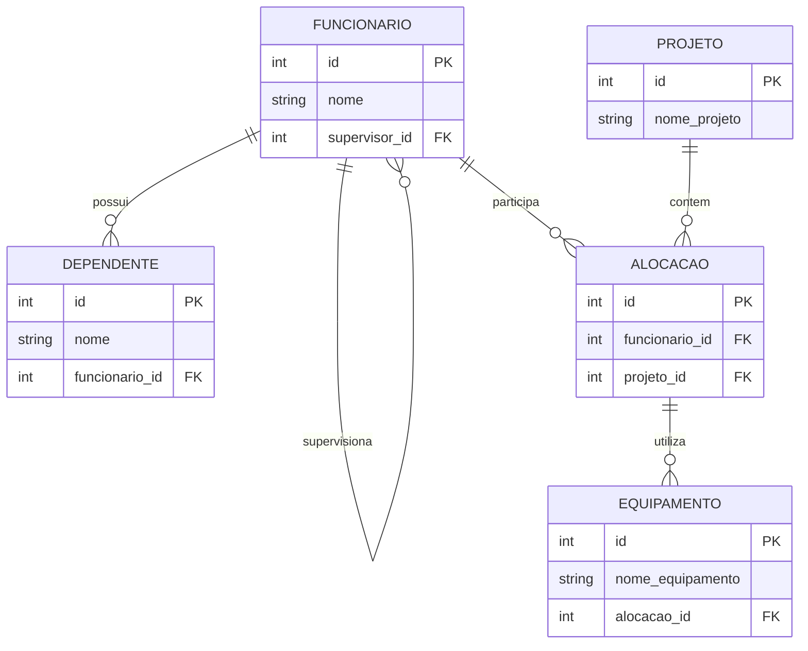

# Sistema de Gerenciamento de Funcionários, Projetos e Equipamentos

## Descrição do Sistema

Este projeto apresenta a modelagem e implementação de um banco de dados utilizando PostgreSQL, aplicando conceitos importantes de modelagem entidade-relacionamento.

O sistema foi desenvolvido para controlar:

- funcionários da empresa;
- dependentes dos funcionários;
- projetos;
- alocação de funcionários em projetos;
- equipamentos utilizados durante os projetos.

O objetivo principal é demonstrar na prática os conceitos de:

- entidade fraca;
- autorelacionamento;
- agregação;
- integridade referencial;
- relacionamentos N:N.

---

# Conceitos Teóricos Aplicados

## Entidade Fraca (Dependência de Existência)

A entidade `DEPENDENTE` depende diretamente da existência de um funcionário.

Por esse motivo, foi utilizada a cláusula:

```sql
ON DELETE CASCADE
```

Isso garante que, ao remover um funcionário, todos os seus dependentes também sejam removidos automaticamente, evitando registros órfãos no banco de dados.

---

## Autorelacionamento

O autorelacionamento foi aplicado na entidade `FUNCIONARIO`.

Cada funcionário pode supervisionar outros funcionários da empresa. Para isso, o campo `supervisor_id` referencia a própria tabela `FUNCIONARIO`.

Exemplo:

- um gerente é um funcionário;
- os subordinados também são funcionários;
- a relação acontece dentro da mesma entidade.

---

## Agregação

A agregação foi utilizada através da entidade `ALOCACAO`.

A tabela `ALOCACAO` representa a participação de funcionários em projetos.

Os equipamentos não são ligados diretamente ao funcionário nem ao projeto. Eles são vinculados à alocação, permitindo identificar qual equipamento foi utilizado por determinado funcionário em um projeto específico.

Isso resolve problemas de contexto e mantém a modelagem organizada.

---

# Diagrama Entidade-Relacionamento



---

# Criação das Tabelas

## Tabela FUNCIONARIO

```sql
CREATE TABLE funcionario (
    id SERIAL PRIMARY KEY,
    nome VARCHAR(100) NOT NULL,
    supervisor_id INTEGER,

    CONSTRAINT fk_supervisor
        FOREIGN KEY (supervisor_id)
        REFERENCES funcionario(id)
);
```

---

## Tabela DEPENDENTE

```sql
CREATE TABLE dependente (
    id SERIAL PRIMARY KEY,
    nome VARCHAR(100) NOT NULL,
    funcionario_id INTEGER NOT NULL,

    CONSTRAINT fk_funcionario
        FOREIGN KEY (funcionario_id)
        REFERENCES funcionario(id)
        ON DELETE CASCADE
);
```

---

## Tabela PROJETO

```sql
CREATE TABLE projeto (
    id SERIAL PRIMARY KEY,
    nome_projeto VARCHAR(100) NOT NULL
);
```

---

## Tabela ALOCACAO

```sql
CREATE TABLE alocacao (
    id SERIAL PRIMARY KEY,
    funcionario_id INTEGER NOT NULL,
    projeto_id INTEGER NOT NULL,

    FOREIGN KEY (funcionario_id)
        REFERENCES funcionario(id),

    FOREIGN KEY (projeto_id)
        REFERENCES projeto(id)
);
```

---

## Tabela EQUIPAMENTO

```sql
CREATE TABLE equipamento (
    id SERIAL PRIMARY KEY,
    nome_equipamento VARCHAR(100) NOT NULL,
    alocacao_id INTEGER NOT NULL,

    FOREIGN KEY (alocacao_id)
        REFERENCES alocacao(id)
);
```

---

# Exemplos de INSERT

## Inserindo Funcionários

```sql
INSERT INTO funcionario (nome, supervisor_id)
VALUES
('Carlos', NULL),
('Ana', 1),
('João', 1);
```

---

## Inserindo Dependentes

```sql
INSERT INTO dependente (nome, funcionario_id)
VALUES
('Marina', 2),
('Pedro', 3);
```

---

## Inserindo Projetos

```sql
INSERT INTO projeto (nome_projeto)
VALUES
('Sistema ERP'),
('Aplicativo Mobile');
```

---

## Inserindo Alocações

```sql
INSERT INTO alocacao (funcionario_id, projeto_id)
VALUES
(2, 1),
(3, 2);
```

---

## Inserindo Equipamentos

```sql
INSERT INTO equipamento (nome_equipamento, alocacao_id)
VALUES
('Notebook Dell', 1),
('Tablet Samsung', 2);
```

---

# Exemplos de SELECT

## Consultando Funcionários

```sql
SELECT * FROM funcionario;
```

---

## Consultando Dependentes

```sql
SELECT * FROM dependente;
```

---

## Consultando Projetos

```sql
SELECT * FROM projeto;
```

---

## Consultando Alocações

```sql
SELECT * FROM alocacao;
```

---

## Consultando Equipamentos

```sql
SELECT * FROM equipamento;
```

---

# Consulta com JOIN

```sql
SELECT
    f.nome AS funcionario,
    p.nome_projeto,
    e.nome_equipamento
FROM alocacao a
INNER JOIN funcionario f
    ON a.funcionario_id = f.id
INNER JOIN projeto p
    ON a.projeto_id = p.id
INNER JOIN equipamento e
    ON e.alocacao_id = a.id;
```

---

# Resultado Esperado da Consulta JOIN

| funcionario | nome_projeto       | nome_equipamento |
|-------------|-------------------|------------------|
| Ana         | Sistema ERP       | Notebook Dell    |
| João        | Aplicativo Mobile | Tablet Samsung   |

---

# Tecnologias Utilizadas

- PostgreSQL
- SQL
- Mermaid
- GitHub

---

# Autor

Projeto desenvolvido para fins acadêmicos na disciplina de Banco de Dados.
